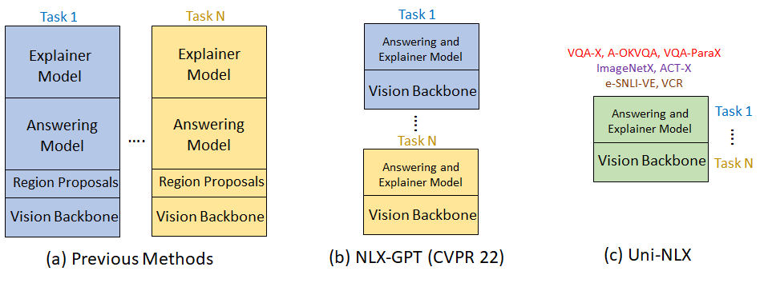

# Uni-NLX: Unifying Textual Explanations for Vision and Vision-Language Tasks

 
 

  

Paper and Dataset coming soon!

### Requirements
- [PyTorch](https://pytorch.org/) 1.8 or higher
- [CLIP](https://github.com/openai/CLIP) (install with `pip install git+https://github.com/openai/CLIP.git`)
- [transformers](https://huggingface.co/docs/transformers/index) (install with `pip install transformers`)
- [cococaption](https://github.com/ruotianluo/coco-caption/tree/ea20010419a955fed9882f9dcc53f2dc1ac65092) 

### Images Download
- [COCO](https://cocodataset.org/#download)  
- [MPI](http://human-pose.mpi-inf.mpg.de/#download). Rename to `mpi`  
- [Flickr30K](http://shannon.cs.illinois.edu/DenotationGraph/). Rename to `flickr30k`  
- [VCR](https://visualcommonsense.com/download/)  
- [ImageNet (ILSVRC2012)](https://www.image-net.org/download.php). Rename to `ImageNet`  
- [Visual Genome v1.2](https://homes.cs.washington.edu/~ranjay/visualgenome/api.html). Rename to `VG_100K`  

### Code
`train_nlx.py`: script for training only 
`test_datasets.py`: script for validation/testing for all epochs on all 7 NLE tasks 
`clip_model.py`: script for vision backbone we use (CLIP visual encoder) 

### Models
- [Pretrained Model (w/o finetuning)](https://drive.google.com/drive/folders/1mSXY-W6OgDU5TOzQ6ShzikvntJi_aAmo?usp=sharing)
- [Pretrained Model (w/ finetuning)](https://drive.google.com/drive/folders/1yCiCT4BUoAP8faeFeHV1HgDJ8Kqu7feL?usp=sharing)

### Results
- [Results (w/o finetuning)](https://drive.google.com/drive/folders/1mL81AJRX2fCrJn0mct5DKV2csWrioZzP?usp=sharing)
- [Results (w/ finetuning)](https://drive.google.com/drive/folders/1b9l2R0p6rQrDOEKso9jFflLOiVnIXPSM?usp=sharing)
